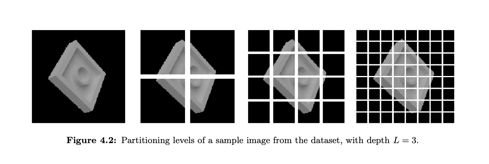

## Spatial Pyramid kernel for Image Classification

Machine Learning II, GCiED

David Bergés, Roser Cantenys and Alex Carrillo

-November 2019, *Universitat Politècnica de Catalunya*

> *Abstract*. This paper presents a method for recognizing toy pieces categories based on the global features that describe color and illumination properties, and by using the statistical learning paradigm. This technique works by partitioning the image into increasingly finer sub-regions and computing a weighted histogram intersection in this space. First, we show the mathematical properties of it to be used as a kernel function for Support Vector Machines (SVMs). Second, we describe the implementation and give examples of how these SVMs, equipped with such a kernel, can achieve very promising results on image classification.



------

### Contents

1. **Introduction**
   1. Aim and motivations
2. **Theoretical aspects**
   1. Kernel learning approaches for image classification
   2. Spatial pyramid matching
      1. *Pyramid match kernel*
      2. *Satisfying Mercer’s condition*
   3. Computational complexity
3. **Dataset**
   1. Set of images
   2. Data preprocessing
4. **Implementation and difficulties**
   1. Data loading and partitioning
   2. Binning
   3. Kernel
      1. *Histograms computation*
      2. *Building the matrix*
5. **Experimenting and results**
   1. Playing with the dataset
6. **Conclusions**
   1. Improvements and further development
7. **References**

------

### Project files

Here is a brew description of the attached files in the delivery folder:

- `data/df128.csv`, `data/df64.csv`: two `.csv` files containing the flattened image with reduced resolution 128x128 and 64x64

- `data/results128.csv`, `data/results64.csv`: two `.csv` files including all the results for our experimentations shown in the paper

- `images/hist1.jpg`, `images/hist2.jpg`: two random images used for the visualization of histogram intersection in `Visualization.ipynb``

- `Visualization.ipynb`: IPython notebook used to generate all different plottings in the paper

- `html_notebooks/Visualization.html`: rendered version of the latter

- `Load_and_Resize.ipynb`: IPython notebook used to read all the raw data and convert it into DataFrames and store it to `.csv` files.

- `html_notebooks/Load_and_Resize.html`: rendered version of the latter

  **ACHTUNG!!** Do not execute this notebook! We specifically included the `.csv` of the processesed data to avoid executing the latter. Notice that the raw image data is not included, and the execution of the latter may take over 30 minutes depending on the computer!

- `scripts/run.py`: Python script used for creating multiple subprocesses and executing several SVMs in parallel in Google Cloud

- `scripts/hist_svm.py`: main script. Automates the process of reading the data and executes the SVM with the specified kernel parameters through the terminal. Type

  ```
  python3 hist_svm.py --help
  ```

  to get some useful hints on how the parameters are passed.

  It accepts 4 arguments:

  - `--data`: csv file from which to read the data
  - `--L`: L value used for partitioning
  - `--quantization`: level of quantization desired
  - `--train_frac`: fraction of training samples to be taken
  - `--test_frac`: fraction of test samples to be taken